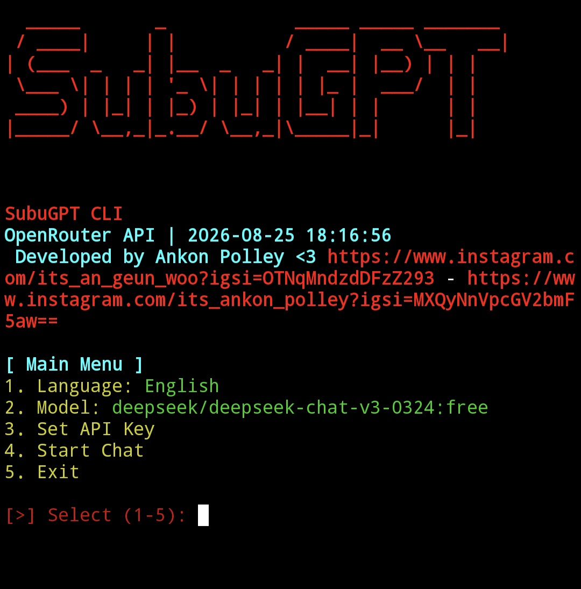
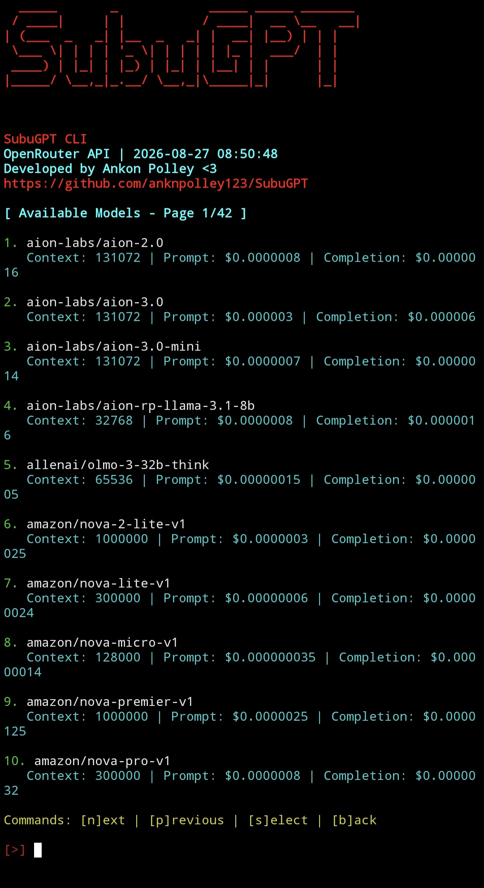

# SubuGPT CLI - OpenRouter Edition

**SubuGPT CLI** is a sleek command-line interface (CLI) for interacting with LLMs via OpenRouter API. It supports multiple models, automatic language detection, and customizable settings — all in a terminal-friendly format.

>  Lightweight. Powerful. Fully terminal-based. Developed by [@anknpolley123](https://github.com/anknpolley123)

---

## 🚀 Features

- 🔗 OpenRouter API integration
- 🌍 Auto language detection (via `langdetect`)
- 🗣️ Multi-language support: English, Indonesian, Spanish, Arabic, Thai, Portuguese
- 💬 Interactive chat session with typing effect
- 🎨 Stylish CLI UI with colors and banners
- 🔧 Easy configuration of API key and model
- 💾 Config auto-saved in `subugpt_config.json`

---

## 📦 Requirements

- Python 3.6+
- `pip` installed
- OpenRouter API key ([get one here](https://openrouter.ai/))

---

## ⚙️ Installation

Clone the repo:

```bash
git clone https://github.com/anknpolley123/SubuGPT
cd SubuGPT
```

## Setup

```bash

#Step 1

#create virtual environment 

run 
    python3 -m venv Ankon
    
    source ankon/bin/activate

# Step 2

# Install all Requirements

pip install -r requirements.txt 

# Step 3

# Set Your Api At kali

export OPENROUTER_API_KEY="Your api key"

# set your model

    # For example aion3.0

 open aion3.py file and Enter your API key in 4th line 

  API_KEY = "sk...."

then save it.
 
## Step 4

#run 
    python3 aion3.py

## Step 5 
then again type

export OPENROUTER_API_KEY="Your api key"

## Step 6
 
Run
    python3 ai.py

# Select the option which is named as API Key option3 
# Select the option 2 
# Paste your Struggled API
# exit


### For every model you have to set api in the model named file and you have to do above process.


```

Open Config File

```bash
{
  "api_key": "Paste Your API Key",
  "base_url": "https://openrouter.ai/api/v1",
  "model": "openrouter/free",
  "language": "English"
}
```


## 🧠 After Setup Run this commad to use it

```bash
python3 ai.py
```

## Menu will appear:

```
[ Main Menu ]
1. Language: English
2. Model: *****
3. Set API Key
4. Start Chat
5. Exit

## Start Chat

```

### 📷 Example Screenshot


```bash
## 🧪 Custom Models

For custom models you have to use all these steps.
```
## Example of Custom Models


## 👨‍💻 Author

GitHub: @anknpolley123

Instagram: @its_an_geun_woo

Project URL: https://github.com/anknpolley123/SubuGPT